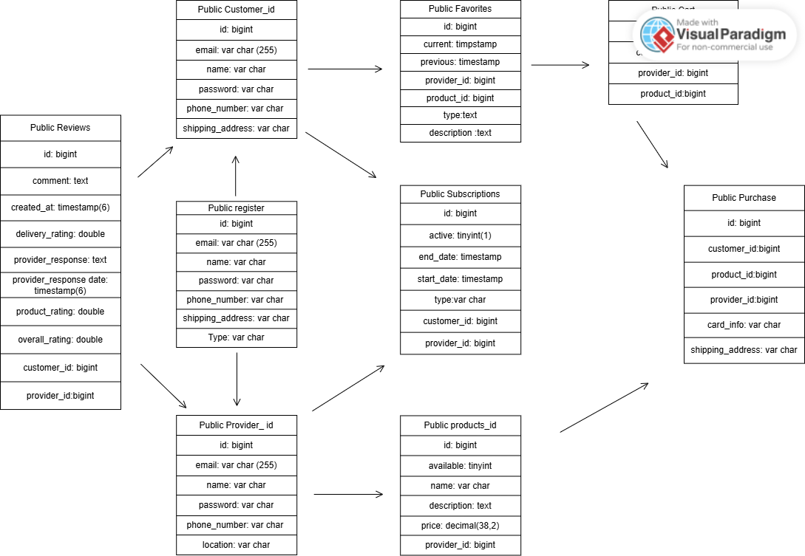

# Centrix Marketplace - Software Design 

Table of Contents
=================
* [Revision History](#revision-history)
* 1 [Product Overview](#1-product-overview)
* 2 [Use Cases](#2-use-cases)
  * 2.1 [Use Case Model](#21-use-case-model)
  * 2.2 [Use Case Descriptions](#22-use-case-descriptions)
    * 2.2.1 [Actor: Farmer](#221-actor-farmer)
    * 2.2.2 [Actor: Customer](#222-actor-customer) 
* 3 [UML Class Diagram](#3-uml-class-diagram)
* 4 [Database Schema](#4-database-schema)

## Revision History
| Name | Date    | Reason For Changes  | Version   |
| ---- | ------- | ------------------- | --------- |
|Aliyah  |10/20  | Initial Design   |    1      |
|      |         |                     |           |
|      |         |                     |           |

## 1. Product Overview
Centrix is a marketplace that allows multiple different products to be sold from clothes to shoes to technology. Customers can browse different providers and their products, in which they can also leave reviews and interact with the same providers.The system supports multiple users at once so there is a free flowing community between the providers, customers, and the adminstrators.
## 2. Use Cases
### 2.1 Use Case Model

### 2.2 Use Case Descriptions

#### 2.2.1 Actor: Provider
##### 2.2.1.1 Sign Up

##### 2.2.1.2 Log In

##### 2.2.1.3 Update Profile

##### 2.2.1.4 Create Produce Boxes

##### 2.2.1.4 View Customer Stats

#### 2.2.2 Actor: Customer
##### 2.2.2.1 Sign Up
A customer can sign up to create their profile with their name, email, password, and address. Emails must be unique. They must select that they are wanting to be a customer.
##### 2.2.2.2 Log In
A customer shall be able to sign in using their registred email and password. After logging in, the customer shall be directed to the homepage of the website(though you dont need to signin to view it.) to see all of the featured products.
##### 2.2.2.3 Browse products
A customer shall be able to view available products. They can do this from the home page or using a search function. They can also filter products by name, type, or providers. They will also be able to select a product and view more details about the product.
##### 2.2.1.4 Subscribe/favorite to Provider/products
when choosing a product, a customer shall be able to subscribe to them with a two-step verification process and favorite them with one click. The provider/products will then appear on their dashboard, and they will be able to cancel the subscription at any time.
##### 2.2.1.5 Review Produce Box
A customer may write a review for a product they recieved as well as the provider. They will be able to rate them  based on quality and delivery time/service.

## 3. UML Class Diagram

## 4. Database Schema
