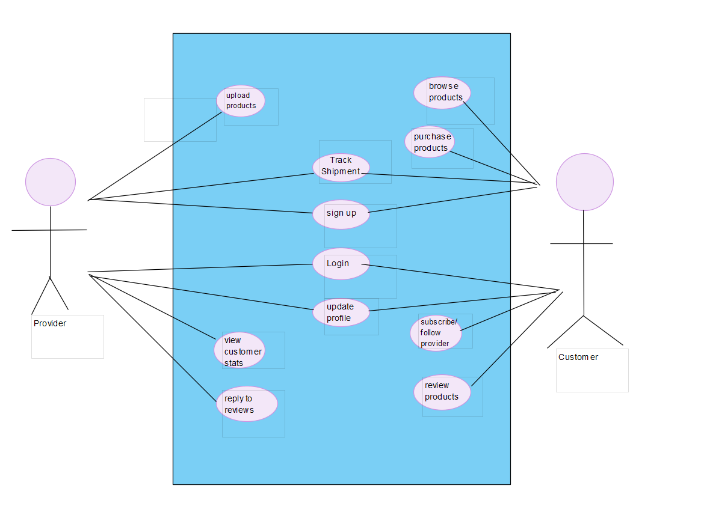
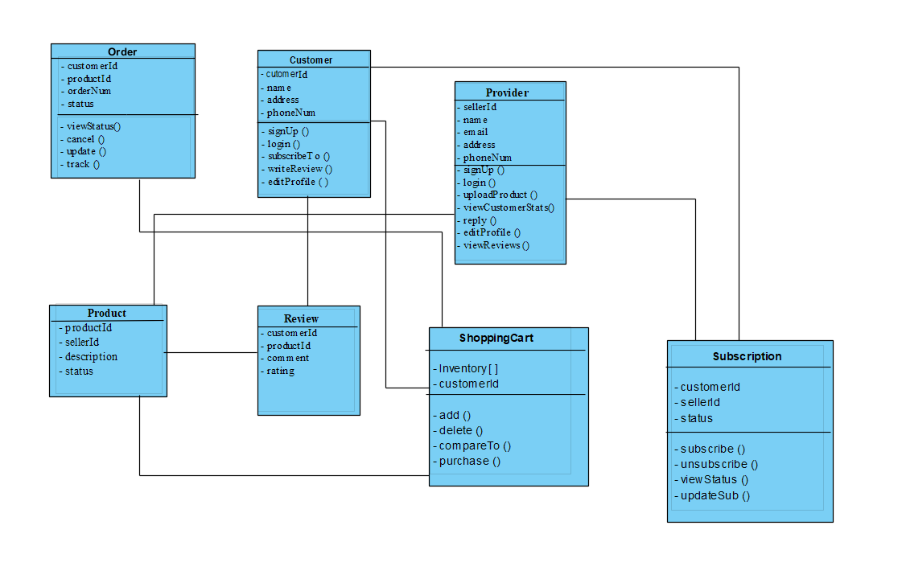
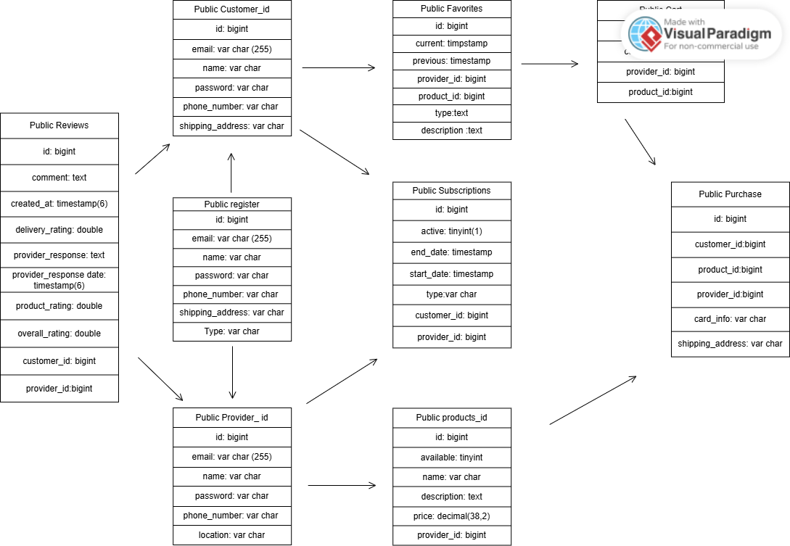

# Centric Marketplace - Software Design

Verion 1
Prepared by Mariono Deleva and Aliyah Williams\
Centrix Marketplace\
Oct 19, 2025

Table of Contents
=================
* [Revision History](#revision-history)
* 1 [Product Overview](#1-product-overview)
* 2 [Use Cases](#2-use-cases)
  * 2.1 [Use Case Model](#21-use-case-model)
  * 2.2 [Use Case Descriptions](#22-use-case-descriptions)
    * 2.2.1 [Actor: Farmer](#221-actor-provider)
    * 2.2.2 [Actor: Customer](#222-actor-customer) 
* 3 [UML Class Diagram](#3-uml-class-diagram)
* 4 [Database Schema](#4-database-schema)

## Revision History
| Name  | Date    | Reason For Changes  | Version   |
| ----  | ------- | ------------------- | --------- |
|Mariono|10/19    | Initial Design      |    1      |
|       |         |                     |           |
|       |         |                     |           |

## 1. Product Overview
Centrix is a marketplace that allows multiple different products to be sold from clothes to shoes to technology. Customers can browse different providers and their products, in which they can also leave reviews and interact with the same providers.The system supports multiple users at once so there is a free flowing community between the providers, customers, and the adminstrators.

## 2. Use Cases
### 2.1 Use Case Model

### 2.2 Use Case Description

#### 2.2.1 Actor: Provider
##### 2.2.1.1 Sign Up
A seller can sign up to create their profile with their name, email, phone number, and address. Emails and Id's are unique
##### 2.2.1.2 Login
A seller would be able to sign into their account using prexisting credentials like Id/email and password. They will be directed to the dashboard where they'll see the home product listing
##### 2.2.1.3 Update Profile
A seller can modify their profile by going to thir account page. They can customize their profile picture, id, password, and description.
##### 2.2.1.4 Upload Products
A seller can post products for consumers to purchase with a descrription, picture, name, and status.
##### 2.2.1.5 Track Shipment
A seller can track the shipment of their product to the destination given by the customer.
##### 2.2.1.6 View Customer stats
A seller can view customer retention and purchasing stats along with their subscription status.
##### 2.2.1.7 View Replies/Reviews
A seller can view the comments and ratings left by customers. They can interact with them to address concerns.

#### 2.2.2 Actor: Customer
##### 2.2.2.1 Sign Up
A customer can sign up to create their profile with their name, email, phone number, and address. Emails and Id's are unique
##### 2.2.2.2 Login
A customer would be able to sign into their account using prexisting credentials like Id/email and password. They will be directed to the dashboard where they'll see the home product listing
##### 2.2.2.3 Update Profile
A customer can modify their profile by going to thir account page. They can customize their profile picture, id, and password.
##### 2.2.2.4 Browse Products
A customer can look through all product listings from the homepage.
##### 2.2.2.5 Purchase Products
A customer can purchase any product listed to the public.
##### 2.2.2.6 Track Shipment
A customer can track the shipment of the product they purchased to make sure its delivered to the desired destination. 
##### 2.2.2.7 Subscribe/Follow Providers
A customer can subscribe to their favorite sellers to keep themselves updated reagarding product listings and interact with the seller. 
##### 2.2.2.8 Review Products
A customer can leave comments and ratings on products they purchased.

## 3. UML Class Diagram

## 4. Database Schema

